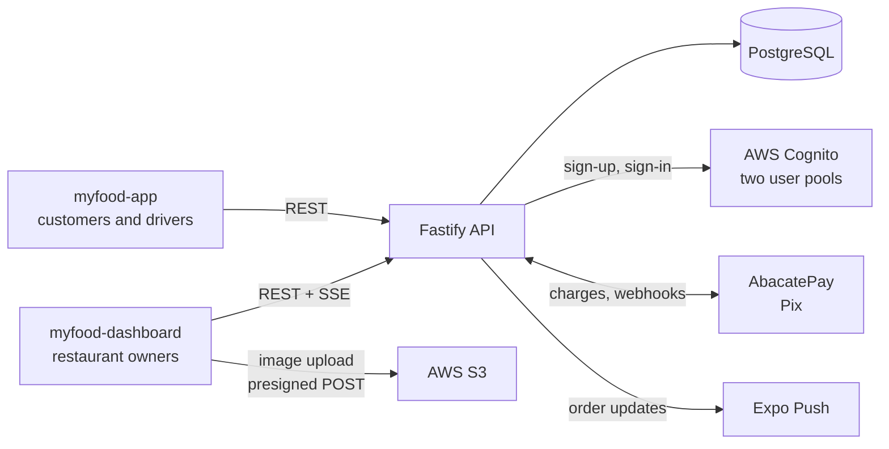
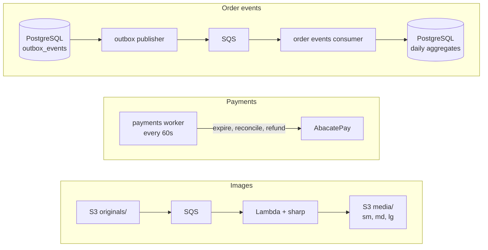
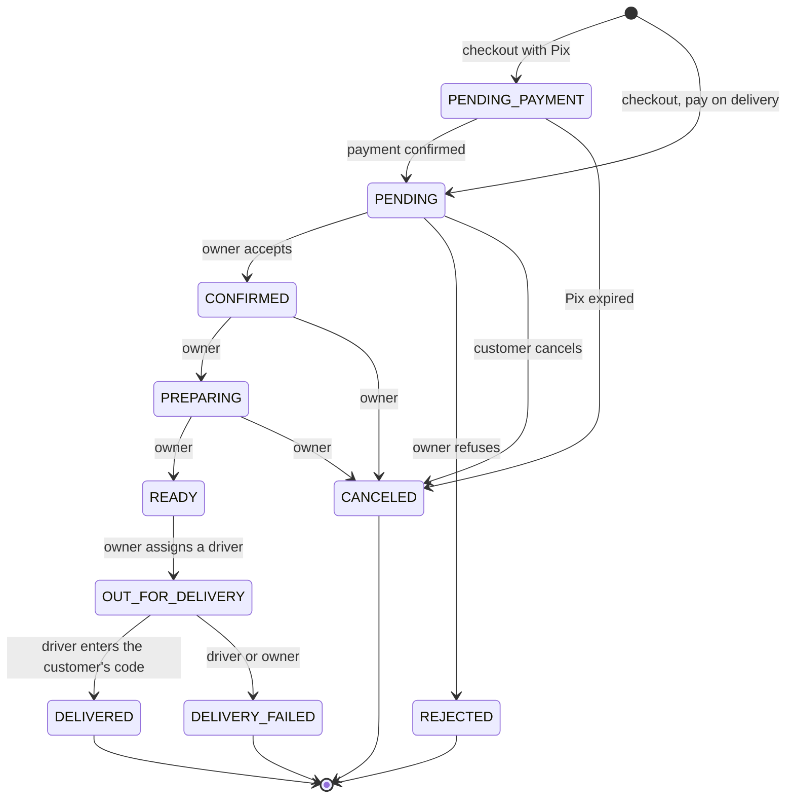

# MyFood API

[](https://github.com/pedrohdionisio/myfood-api/actions/workflows/ci.yml)


Backend of **MyFood**, an iFood-style food delivery platform: restaurants run their store from a web
dashboard, customers order from a mobile app, and drivers confirm each delivery with a code only the
customer holds.

| Repository | What it is |
|---|---|
| **myfood-api** (this one) | Fastify REST API, background workers and AWS Lambdas |
| [myfood-dashboard](https://github.com/pedrohdionisio/myfood-dashboard) | React dashboard for restaurant owners |
| [myfood-app](https://github.com/pedrohdionisio/myfood-app) | React Native (Expo) app for customers and drivers |

**[Browse the API reference →](https://pedrohdionisio.github.io/myfood-api/api/)** — every route,
schema and error, generated from the code.

## Contents

- [Highlights](#highlights)
- [System overview](#system-overview)
- [Order lifecycle](#order-lifecycle)
- [Engineering decisions](#engineering-decisions)
- [See it run in two commands](#see-it-run-in-two-commands)
- [Running the full stack](#running-the-full-stack)
- [Tests and CI](#tests-and-ci)
- [Project layout](#project-layout)
- [Stack](#stack)

## Highlights

- **Clean architecture with dependency inversion.** `http` → `application` → `domain`, with `infra`
  implementing the ports. Use cases never import Drizzle, Fastify or the AWS SDK.
- **Checkout never trusts the client.** Prices, availability, opening hours, delivery city and fee
  are recalculated from the database, and an `Idempotency-Key` makes a double tap place one order.
- **A delivery code that cannot leak.** Only the customer's own order routes declare it; tests walk
  the OpenAPI spec and every restaurant and driver payload looking for it.
- **Pix payments** (AbacatePay) with webhooks verified twice, deduplicated, and reconciled by a
  worker when a webhook is lost.
- **Transactional outbox → SQS → idempotent consumers** keep the analytics aggregates exact.
- **Real time** for restaurants over SSE, push notifications for customers and drivers over Expo.
- **Images** go straight to S3 with a presigned POST; a Lambda produces three WebP variants.
- **80 documented operations**, generated from the same Zod schemas that validate every request and
  serialize every response.

## System overview

What happens during a request:



What happens in the background:



The outbox publisher, the order events consumer and the payments worker run as containers next to
the API, because they need Postgres, which is still a local container. Image processing never
touches the database, so it is the one piece that runs as a Lambda.

## Order lifecycle

Every transition goes through one state machine in `src/domain/order-status.ts` and writes its
history row in the same transaction.



An order waiting for its Pix does not exist for the restaurant: it appears on the dashboard only
when the payment confirms. A paid order that is rejected or canceled is refunded by the payments
worker.

## Engineering decisions

The full reasoning, with the alternatives considered, is in
[`docs/architecture.md`](docs/architecture.md). The short version:

| Decision | Why |
|---|---|
| **Transactional outbox** instead of publishing to SQS from the request | The event row commits with the order, so an event is never lost and never sent for a rolled-back change. Consumers deduplicate by message id, so at-least-once delivery cannot double-count revenue. |
| **SSE** for the restaurant dashboard, not WebSocket | The dashboard only listens. SSE is plain HTTP, reconnects on its own, and the event is a narrow DTO — the dashboard refetches the order, so nothing sensitive travels on the stream. |
| **Pix reconciliation** instead of trusting the webhook | The webhook is the fast path. A worker asks the gateway for the real status before canceling an expired charge, and refunds a payment that arrives after the order was canceled. |
| **Delivery code enforced by structure and by SQL** | Fastify serializes only declared fields, and only the customer's routes declare the code. Confirmation is one conditional `UPDATE`, with the attempt limit counted in the same locked transaction, so parallel guesses cannot get past it. |
| **Membership checked in the database on every request** | Roles live in `restaurant_members`, not in token claims, so deactivating a driver takes effect on their next request, not when the token expires. |
| **City-based delivery, no geolocation** in the MVP | Discovery and the delivery fee work by city with a flat fee. Coordinates, radius and distance-based fees are a deliberate follow-up, with the cost of adding them written down. |
| **Real Postgres in tests, fakes only for external services** | Order numbering, idempotency and delivery confirmation are enforced in SQL; mocking the database would test a copy of the rules, not the rules. |

## See it run in two commands

You do not need an AWS account to see the API working. With **Docker**, **Node.js 24** and **pnpm**:

```bash
pnpm install
pnpm test
```

The feature suite starts a real PostgreSQL with Testcontainers, applies every migration and drives
the whole application through its HTTP layer — sign-up, menu, checkout, the kitchen flow, delivery
confirmation, Pix webhooks, analytics and the SSE stream — with Cognito, S3, AbacatePay and Expo
replaced by in-memory fakes.

The [API reference](https://pedrohdionisio.github.io/myfood-api/api/) is generated from the route
schemas and published to GitHub Pages; it is also served at `/docs` on a running API.

## Running the full stack

The API is not deployed; it runs locally with Docker, against real pay-per-use AWS resources
provisioned with the Serverless Framework.

```bash
pnpm install
cp .env.example .env

# Cognito pools, S3 bucket, SQS queues and Lambdas.
# Set SES_FROM_ADDRESS to an address verified in SES first, then copy the stack outputs into .env.
pnpm deploy

docker compose up -d        # PostgreSQL, the API on :3333 and the three workers
pnpm db:migrate
pnpm db:seed                # optional: restaurants, customers and order history
```

Always deploy with `pnpm deploy`: it rebuilds the Lambda layer for `sharp` first.

| Script | What it does |
|---|---|
| `pnpm dev` | API with reload, outside Docker |
| `pnpm worker:outbox` · `worker:orders` · `worker:payments` | The workers, outside Docker |
| `pnpm db:generate` · `db:migrate` | Create and apply migrations |
| `pnpm docs:openapi` | Regenerate `docs/api/` from the routes |
| `pnpm lint` · `pnpm typecheck` | Biome and `tsc` |
| `pnpm test` · `test:unit` · `test:feature` | Vitest |

## Tests and CI

| Suite | What it covers |
|---|---|
| `tests/unit` | Domain rules (state machine, pricing, opening hours across midnight, idempotency fingerprint), the sign-up saga, notifications, image variants, log redaction, and every DI token resolving |
| `tests/feature` | Each route module end to end through `app.inject()` against a real Postgres |
| `tests/feature/invariants` | Rules checked for every route at once: which routes may expose the delivery code, which require a token or a restaurant membership, concurrent checkouts and confirmations |

Each Vitest worker gets its own database, cloned from a migrated template, so the suite runs in
parallel in seconds.

[CI](.github/workflows/ci.yml) runs on every push and pull request: lint, typecheck, the whole
suite, and two drift checks — it fails if a schema change ships without its migration, or if the
committed OpenAPI spec no longer matches the routes.

## Project layout

```
src/
  domain/         pure rules: state machine, pricing, opening hours, delivery code
  application/    ports (interfaces) and one use case per operation
  infra/          Drizzle repositories and the Cognito, S3, SQS, AbacatePay and Expo adapters
  http/           Fastify app, plugins and routes
  schemas/        Zod schemas: the HTTP contract
  config/         environment, logger and AWS credentials
  db/             Drizzle schema and migrations
  di/             composition root
  workers/        outbox publisher, order events consumer, payments sweeper
  lambda/         image processing and the Cognito e-mail trigger
tests/
  unit/  feature/  support/
docs/
  architecture.md       decisions and their reasoning
  myfood-schema.dbml    database schema (dbdiagram.io)
  api/                  generated OpenAPI spec and reference page
```

The product is built for the Brazilian market, so user-facing text — error messages and the API
reference summaries — is in Portuguese, and so are code comments. Identifiers, documentation and
commits are in English.

## Stack

Node.js 24 · TypeScript · Fastify · Zod · tsyringe · Drizzle ORM · PostgreSQL 16 (`pg_trgm`,
`unaccent`) · AWS Cognito, S3, SQS, SES and Lambda · Serverless Framework · AbacatePay · Expo Push
· Pino · Vitest · Testcontainers · Biome · Docker · GitHub Actions

## Author

**Pedro Henrique Dionisio** — [LinkedIn](https://www.linkedin.com/in/pedrohenriquedionisio/)

## License

[MIT](LICENSE)
